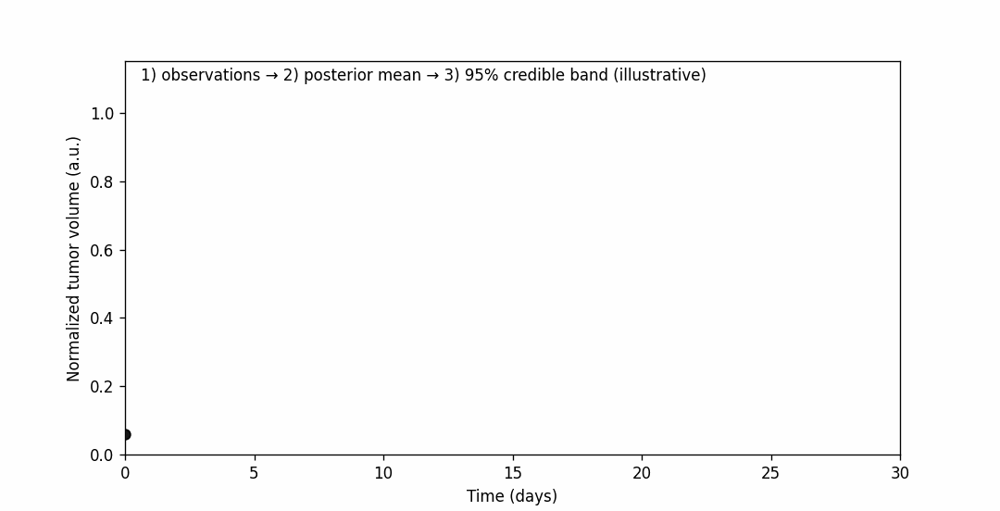

# 👾 Welcome to my GitHub page 👾

Currently, I develop and calibrate biology-based models (ODEs) for tumor growth and treatment response, with emphasis on **Bayesian parameter estimation**, **model selection**, and **uncertainty quantification**. I also work with data science and modeling applied to epidemiology.

## 📚 Academic Background

- 🎓 PhD student in Biometrics at São Paulo State University (Currently)
- 🎓 MSc in Biometrics at São Paulo State University (2023)
- ☢️ Medical Physicist at São Paulo State University (2021)

## 🚀 Learning the following languages:

  
  
  

---

## 📈 Research snapshot
Bayesian trajectory + 95% uncertainty band (auto-generated):

  

> *Note:* the animation is a **stylized illustrative graphic** meant to represent typical outputs from Bayesian calibration (posterior mean + credible interval).
---

## 🧠 Research interests
- Bayesian calibration of mechanistic ODE models (MCMC, hierarchical models)
- Model selection & predictive validation
- Sensitivity analysis & identifiability
- Computational oncology (radiotherapy, immunotherapy, imaging-informed modeling)
- Computational epidemiology
- Biometry

---

## 🧰 Methods & toolbox
- **Modeling:** ODE systems, treatment-effect terms, phenomenological + biology-based models  
- **Inference:** MCMC (e.g., ensemble samplers), posterior predictive checks, uncertainty quantification
- **Python stack:** NumPy, SciPy, Matplotlib, ArviZ, emcee, SaLib  

---

## 📬 Contact me
- **Email:** g.rodrigues2@unesp.br
- **Linkedin:** https://www.linkedin.com/in/guilherme-rodrigues-38166917b
- **Lattes:** https://lattes.cnpq.br/6126683132640765
- **ORCID:** https://orcid.org/0000-0001-7113-8937 
- **ResearchID:** https://researchid.co/grodrigues

